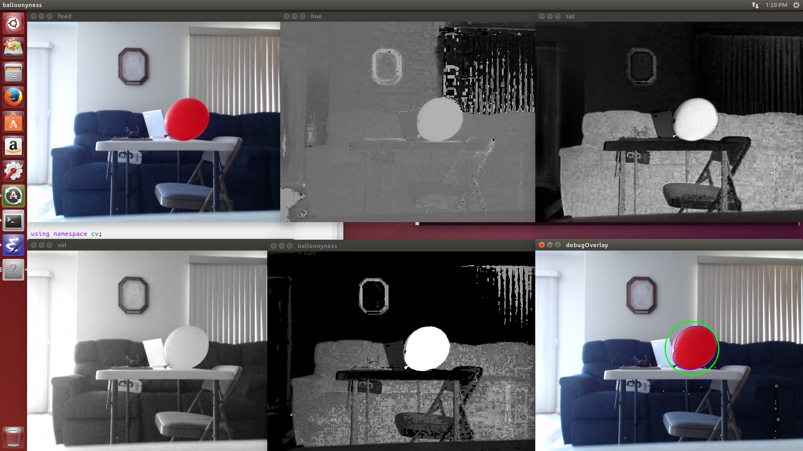

This repository contains the computer vision code for our entry into the 2014
[Sparkfun AVC](https://avc.sparkfun.com/2014) contest. Part of this year's
contest is to attempt to find and pop 36" red balloons that are placed randomly
on the course.

This code is based on a hardware-accelerated version of the [OpenCV](http://opencv.org/)
library and runs on a [Nvidia Jetson TK1](http://www.nvidia.com/object/jetson-tk1-embedded-dev-kit.html)
development board that is shock-mounted to the multirotor aircraft.

Below is a screenshot illustrating the vision pipeline of the app from the raw
feed to the resulting identification of a baloon on the debugOverlay.

